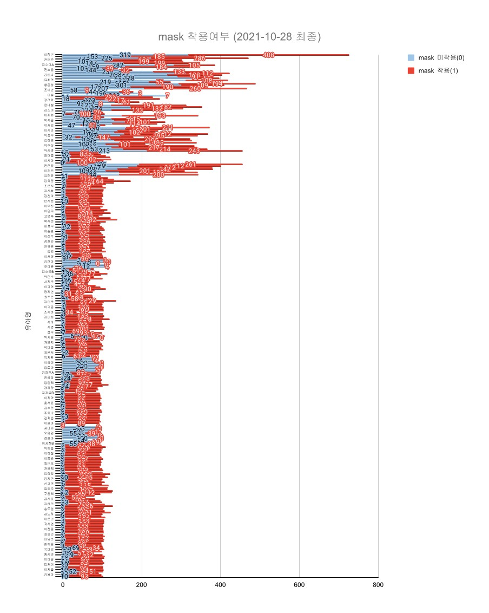
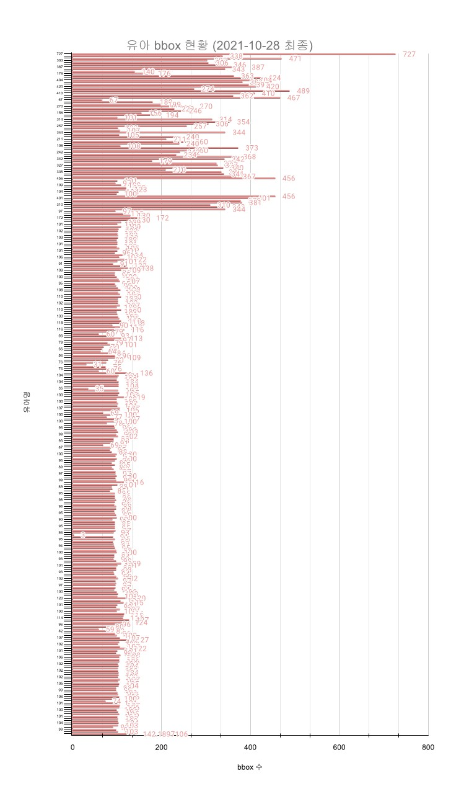
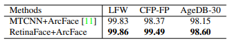
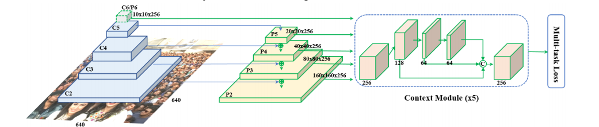
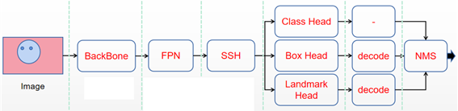

# 중기부 유아 안면 인식

## Introduction
This Child Recognition project is 2 stage project that are Detect model based on [Retinaface](https://github.com/biubug6/Pytorch_Retinaface) framework & Recognition model based on [Insightface/arc-face](https://github.com/deepinsight/insightface/tree/master/recognition/arcface_torch)
: Detect model : Vision, SSD, FPN, multi-task learning, bbox & 5 keypoint
: Verification model : Few-Shot image Classification, Metric learning,
: finalize Development : ~ 21.11
: deadline of project : ~ 22.10

## explain api-face API

### configuration
Detect
Verification

### In terminal
가능한 기능은 demo/explain-api-detail 폴더 안에 설명하였습니다.
1. install python -> make virtual environment
2. 터미널에서 " pip install -r requirements.txt " 실행
3. 터미널에서 " python3 main.py " 실행
4. 내부망 주소창에 서버주소:3333/rec 실행 [ ex) 192.168.*.*:3333/rec ]
5. 사용 목적에 따라 폴더 내 순서로 진행

### Major Folder
- **api/**
  Like the common Few-shot project, It involves facial class(support set) that want to recognize and can create new class using our /new API.
- all class in support set are saved as npz file like "bestbackup.npz" in this folder

- **detect**
  It is a model for predicting dog or cat box&poses. Even if not all models are used, this code is prepared for future fine_tunning
- **mmdetection**
  It is folder to detect child face. It is composed of some folders, but the main file for API is detecting_tool.py
- 

### Main.py -- argparse
- **port**
: --port number, defalt 3334
- **device**
: --device gpu, default 'cuda:1'
- **save img path**
: --save_img_path save path, default './saved/test'
- **recognition checkpoint**
: --recg_ckdir checkpoint Path, default 'checkpoint/real'
- **model probability**
: --proba_conf [num, num, num], default [1.2, 1.4, 0.3]

## Data
This project model use [반려동물 구분을 위한 동물 영상](https://aihub.or.kr/aidata/34146) for Classification and [animalpose](https://sites.google.com/view/animal-pose/) for pose detection and [COCO](https://cocodataset.org/#home) for bbox detection

## License
This project is released under the [License](https://github.com/phamquiluan/ResidualMaskingNetwork/blob/master/LICENSE).

## Data
data_folder : child16, kface, IJB
label is ID

### child_face dataset
+ child images : 39,493
+ child face : 44,221
+ label : 311 (detail of images per class or mask is in .pdf file)
+ And please check finaldata.csv for label information
+ child_id, mask(0,1), face bbox(x,y), arousal (0~1), valence(0~1) information in csv file 

### kface
+ korean face images 4,320,000 ( in ai-hub kface )
+ This project use only middle_resolution data
+ ID / light / glass or mask / light force / expression / light angle
+ label : 400
+ please check https://github.com/k-face/k-face_2019

### IJB
+ 1,338,000 images from Nist
+ label : 28,936
+ Detail of data is in IJB-C/README.pdf

### youtubeface
+ youtubefaceDB's image
+ label : 1,595
+ please check README.txt 확인
+ some labels are same with IJB's labels. so dataset/mix.py file make "mix" folder that solves this issue. 
(+ Labels that are not in English need a different encoder type)

## Models

### Detect Model
https://github.com/biubug6/Pytorch_Retinaface

**Retinaface**

: It is the best detect model that can train arc-face model better at the beginning of 2021

This model usually have 50ms time to detect face for 1 face in 1 image.
our KPI is 60ms, so speed is another challenge in this project.
only cls & bbox & landmark loss is selected except for 3D reconstruction loss, which are enough to detect in our child data.
* low quality face isn't work well for face recognition model.

1. 5 ficial keypoints found by this model shows good performance in face alignment method for face verification
2. The 2019 SOTA model and still good performance in 2021
3. It meets the speed KPI of 60ms. 
4. It is easy to replace this model with a better model later (SCRFD)

- SCRFD : keypoint support but not enough update that time. ( too many errors )
- Tinaface : better performance in accuracy. but not good for our Speed KPI
- VarGFaceNet, PFEfuse-match : Retinaface is better than both in accuracy.
- DSFD : This model have good performance similar with Retinaface, but it's not support keypoint detect
- YOLO base OD : it's not support keypoint detect
- MTCNN : It is easy model to use. but bad performance and old model

**Detail**
- Resnet50 backbone & FPN figure. and context module(like SSH) use 5 layer of pyramid.

: after that, it goes through an intermediate process for using Class, Bounding Box and Landmark loss, respectively
: 

: 
- It is hard sharing Multi-task loss function like Mask-RCNN

### Verificataion Model
- Identification: Identifying oneself to the system with an ID
- Verification: User identification based on pre-shared knowledge.
- This project use Insightface code
1. Insightface have a lot of SOTA model in Face verification.
2. better model will be updated in Insightface later.
3. 2021, mask, race and infant recognition challenge were in progress on this offical github.
It is a challenge closely related to this project. (MFR challenge) https://arxiv.org/pdf/2106.15288.pdf

#### Arcface Detail

#### cosface Detail

#### Metric learning
tag : Meta learning, Contrastive learning, distance learning

## info
+ 2 or 5 keypoint detect

## ETC

